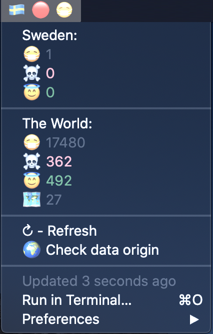

# bitbar-corona

A bitbar plugin for info on the spread of the corona virus
[BitBar](https://getbitbar.com)  
Uses data from the [GIS Dashboard](https://gisanddata.maps.arcgis.com/apps/opsdashboard/index.html#/bda7594740fd40299423467b48e9ecf6) by [Johns Hopkins](https://systems.jhu.edu/research/public-health/ncov/)



Shows:  
😷 Number of reported sick  
☠️ Number of reported deaths  
😇 Number of reported recoveries  
🗺 Number of countries with reported cases  

# Installation & Setup

- Install [BitBar](https://getbitbar.com)
- Clone or download [this repository](https://github.com/jramer/bitbar-corona) to your Mac
- Copy `corona.1h.sh` to your BitBar Plugins Directory
- Edit `corona.1h.sh` and setup your country preferences:

```
COUNTRY='Sweden' #Country you want warnings for
COUNTRY_FLAG='🇸🇪' #The countrys flag emoji
WARNING_THRESHOLD=0 #Threshold for number of infections reported in the country. Can be used to reset warning to discover new infections.
```

You might need to set the paths as well:

```
FPING_PATH=/usr/local/bin/fping
CURL_PATH=/usr/bin/curl
JQ_PATH=/usr/local/bin/jq
```

To find the paths use e.g. `where curl`.

If you need to install any of the dependencies, use [homebrew](https://brew.sh/):

```
brew install jq fping
#curl should already exisit in macos. But if not:
#brew install curl
```
